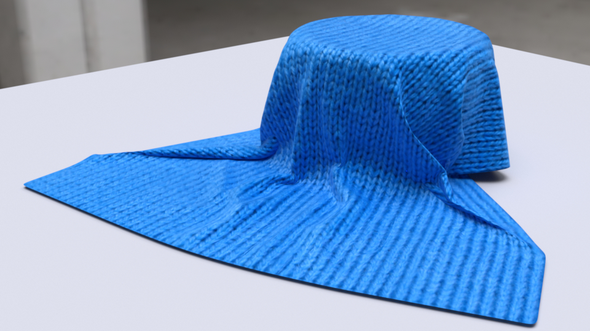
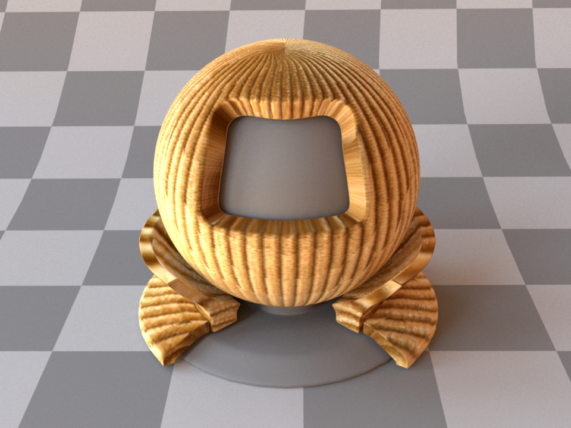

# BTF Rendering
Custom plugin in Python to render measured BTF (Bidirectional Texture Function)  with [Mitsuba 2](https://github.com/mitsuba-renderer/mitsuba2).



## Measured BTF (*measuredbtf*)
| Parameter | Type | Description | 
| :-- | :-- | :-- |
| filename | string | Filename of the ZIP file to be loaded. |
| apply_inv_gamma | boolean | Whether to apply inverse gamma correction. If the input is the gamma-corrected image, this process should be applied. (Default: *true*) | 
| to_uv | transform | Specifies an optional 3x3 UV transformation matrix. A 4x4 matrix can also be provided, in which case the extra row and column are ignored. (Default: none) |

| | | 
| :-: | :-: |
| |  |
| UBO2003 IMPALLA | UBO2003 CORDUROY |

This custom plugin implements a BTF for rendering reflections of textures taken in a real scene. The BTF is a set of images with different illumination and viewing directions.

`filename` is the name of the image zip file. This zip file should follow the format of the BTF dataset of University of Bonn. It is a set of image files with the naming composition like *WoolPKNT256_00084_tl015_pl000_tv015_pv120.jpg*.
Download the [UBO2003](https://cg.cs.uni-bonn.de/en/projects/btfdbb/download/ubo2003/) or [ATRIUM](https://cg.cs.uni-bonn.de/en/projects/btfdbb/download/atrium/) dataset for rendering.

```xml
<bsdf type="measuredbtf">
    <string name="filename" value="UBO_IMPALLA256.zip"/>
    <transform name="to_uv">
        <scale value="5"/>
    </transform>
</bsdf>
```

### Warning
The execution of this plugin is **extremely slow**. And, It can **only be implemented in the `scalar_rgb` variatnt**. Speeding up and supporting another variants (e.g. `gpu_rgb`) is the future work.
