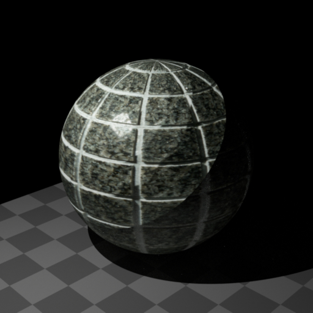

# BTF Rendering
Custom plugin in Python to render measured BTF (Bidirectional Texture Function)  with Mitsuba 2.


## Requirement in Python
Make sure that the following libraries are available in python.
- [SciPy](https://www.scipy.org/)
- [BTF Extractor](https://github.com/2-propanol/BTF_extractor)

## Usage 
1. Clone and compile [Mitsuba 2](https://github.com/mitsuba-renderer/mitsuba2). Check whether you can `import mitsuba` in python.
2. Clone this repository and move it there.
```bash
git clone https://github.com/elerac/btf-rendering.git
cd btf-rendering
```
3. Download [UBO2003 BTF Dataset](https://cg.cs.uni-bonn.de/en/projects/btfdbb/download/ubo2003/). Make directory named `UBO2003/` and save the data under there. OR, you can run [download_large_data.py](https://github.com/elerac/btf-rendering/blob/master/download_large_data.py) and the data will download automatically.  
Have you placed BTF Dataset as shown below?
```
.
├── UBO2003
│   ├── UBO_IMPALLA256.zip
│   ├── ...
├── custom_bsdf
├── download_large_data.py
├── rendering.py
├── scenes
├── ...
```
4. Run [rendering.py](https://github.com/elerac/btf-rendering/blob/master/rendering.py) and get [rendered image using BTF](https://github.com/elerac/btf-rendering/blob/master/documents/simple_sphere.jpg).

## Measured BTF (*measuredbtf*)
| Parameter | Type | Description | 
| :-- | :-- | :-- |
| filename | string | Filename of the BTF database file to be loaded. The type of dataset is distinguished by its extension. .zip for UBO2003, .btf for UBO2014.|
| reflectance| float | Adjust the reflectance of the BTF. (Default: 1.0) |
| apply_inv_gamma | boolean | Whether to apply inverse gamma correction. If the input is the gamma-corrected image, this process should be applied. (Default: *true*) | 
| power_parameter | float | Determine the smoothness of the interpolation. The smaller the value, the smoother it is. (Default: 4.0) |
| wrap_mode | string | Controls the behavior of texture evaluations that fall outside of the [0,1] range. The `repeat` and `mirror` options are currently available. (Default: `repeat`)|
| to_uv | transform | Specifies an optional 3x3 UV transformation matrix. A 4x4 matrix can also be provided, in which case the extra row and column are ignored. (Default: none) |

| | | 
| :-: | :-: |
| |  |
| UBO2003 IMPALLA | UBO2003 CORDUROY |

This custom plugin implements a BTF for rendering reflections of textures taken in a real scene. The BTF is a set of images with different illumination and viewing directions.

`filename` is the name of the BTF database file. This file should follow the format of the BTF dataset of University of Bonn.
Download the [UBO2003](https://cg.cs.uni-bonn.de/en/projects/btfdbb/download/ubo2003/) or [ATRIUM](https://cg.cs.uni-bonn.de/en/projects/btfdbb/download/atrium/) or [UBO2014](https://cg.cs.uni-bonn.de/en/projects/btfdbb/download/ubo2014/) dataset for rendering.

```xml
<bsdf type="measuredbtf">
    <!-- UBO2003 case -->
    <string name="filename" value="UBO_IMPALLA256.zip"/>
    <transform name="to_uv">
        <scale value="5"/>
    </transform>
</bsdf>
```

### Interpolation and Power Parameter
This custom plugin interpolates BTF. The interpolation is done by [k-nearest neighbor sampling](https://en.wikipedia.org/wiki/K-nearest_neighbors_algorithm) and [inverse distance weighting](https://en.wikipedia.org/wiki/Inverse_distance_weighting).
The weight of the inverse distance weighting can be adjusted by the `power_parameter` *p*. The parameter *p* determines the influence of the distance between the interpolation points. The smaller *p* is, the smoother the interpolation will be.

The following figures show the difference in appearance when *p* is changed. When *p* is small (*p*=1), the texture is smooth and specular reflection is weak. On the other hand, when *p* is large (*p*=32), the texture has discontinuous boundaries. This is because the angle of the captured BTF data is sparse.
| | | | | 
| :-: | :-: | :-: | :-: |
|  |  |  |  |
| *p* = 1 | *p* = 2 | *p* = 4 | *p* = 32 |


## Warning
In the `scalar_rgb` variant, the execution of this plugin is **extremely slow**. Thus, using the `gpu_rgb` variant is recommended.